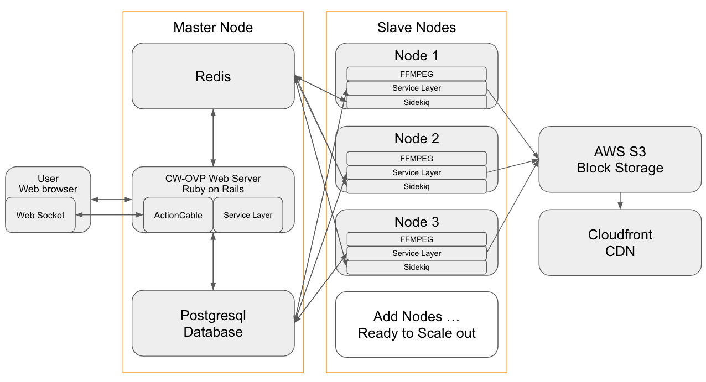

[](https://travis-ci.com/x1wins/CW-OVP)

# CW-OVP
* [Preview](#Preview)
* [Introduction](#Introduction)
    * [EN](#EN)
    * [KO](#KO)
* [Skill Stack](#Skill-Stack)
* [Feature](#Feature)
* [System Structure](#System-Structure)
    * [Docker Swarm with Scale out](#Docker-Swarm-with-Scale-out)
* [Minimum Requirements for Production](#Minimum-Requirements-for-Production)
* [Roadmap](#Roadmap)
* [Getting started](#Getting-started)
    * [Storage config](#Storage-config)
    * [How To Run Development mode with Docker-compose](#How-To-Run-Development-mode-with-Docker-compose)
    * [How To Run Development mode without docker](#How-To-Run-Development-mode-without-docker)
* [Deploy](#Deploy)    
    * [Docker Swarm](#Docker-Swarm)    
    * [Docker Swarm with Jenkins](#Docker-Swarm-with-Jenkins)    
* [Sample video file download](#Sample-video-file-download)    

## Preview
          


## Introduction
### EN
OVP(online video platform) mean that online transcoding, packaging and hosting service with video file upload to online storage or cloud system.<br/>
Internet speed was increase and many internet user need streaming service than Content provier and Broadcaster use OVP or solution for start streaming service with Mobile, web, OTT(over the top).<br/>
Famous OVP business company is mux.com, dacast.com, vimeo.com, Dacast.com, Amazon elastic transcoding and Wowza solution.<br/>
But Korea OVP company is not many and company should spend more than thousand of dollar per month to OVP.<br/>
CW-OVP project will commit helping for who want ready for streaming service.<br/>
This is why CW-OVP project was built.

### KO
OVP(online video platform)란<br/>
온라인 저장소 또는 클라우드에 영상파일을 업로드하여 인코딩과 호스팅 서비스를 제공함을 말한다.<br/>
인터넷 속도의 발달과 사용자들의 요구로 많은 스트리밍 서비스가 생겨나고 있고, 기존의 방송사들도 흐름에 따라  Mobile, web, OTT(over the top) 셋탑기기의 스트리밍 서비스를 제공하기 위해서 OVP(online video platform)이나 솔류션을 많이 사용하고 있다.<br/>
대표적인 해외 OVP는 mux.com, dacast.com, vimeo.com, Dacast.com 등 서비스들이 존재하며 솔류션으로는 Wowza가 존재한다.<br/>
그러나 국산 OVP 서비스는 많은 활성화가 되어 있지 않고, 외산 서비스를 사용하면 인코딩 서비스만 한달에 수백, 수천만원 이상의 비용이 들어가며, 오픈소스로도 많이 존재 하지 않고 있다.<br/>
대부분의 스트리밍 서비스들은 OVP에 비싼 이용을 지불하여 비지니스를 진행하고 있다.<br/>
이에 오픈소스로 OVP를 개발하여 기업이나 단체, 개인에 도움이 되고자 한다.

## Skill Stack
|what use|description|
|---|---|
|FFMPEG|video transcoding, packaging|
|h.264|Codec|
|HLS|Protocol|
|Ruby on Rails|web framework, websocket(action cable)|
|Redis|queue, pub/sub|
|Sidekiq|background job, queue|
|Postresql|database|
|Docker, docker-compose|install environment|
|Docker Swarm|Clustering (Scale out)|

## Feature
- Clustering ffmpeg worker with sidekiq on docker swarm
- Transcoding, Packaging with ffmpeg for HLS
    - Generated multiple m3u8 for Adaptive Streaming
- Extract 10 random Thumbnail images during video packaging
- AWS S3 for stored video, thumbnail assets
- AWS Cloudfront for CDN
- Real time base on web UI with websocket(Action Cable), ruby on rails
- Open source(MIT licence) and Free, but need hardware…

## System Structure

### Docker Swarm with Scale out
|master node|slave-1 node|slave-2 node|you can scale out slave node...|
|---|---|---|---|
|redis|sidekiq|sidekiq|sidekiq...|
| |ffmpeg|ffmpeg|ffmpeg...|
|postgresql||||
|ruby on rails||||

## Minimum Requirements for Production
- Required AWS S3, Cloudfront [.env.dev.s3](/.env.dev.s3)
- Server Spec
    - CPU
        - 4 or 8 more Cpu per server (c5.xlarge on aws ec2)
    - Disk
        - more 10 Gb
        - if you will upload heavy video or more 10Gb, need more space
    - Memory
        - more 2Gb
    - Number of Server
        - master : 1 or more
        - slave : 2 or more

## Roadmap
[Roadmap](/ROADMAP.md)

## Getting started
### Storage config
* AWS S3 Storage
    1. How to make s3 bucket for AWS_ACCESS_KEY_ID, AWS_SECRET_ACCESS_KEY
        - https://www.changwoo.org/x1wins@changwoo.net/2019-10-23/Upload-file-to-S3-with-AWS-CLI-d12442012c
    2. How to make cloud front url for AWS_CLOUDFRONT_DOMAIN 
        - https://www.changwoo.org/x1wins@changwoo.net/2019-10-23/using-cloud-front-with-s3-51d2eb17bb
    3. Update ```.env.dev.s3``` file for s3, cloudfront
        1. open ```.env.dev.s3```
        2. add below of code and update each value                                                              
            ```
                AWS_ACCESS_KEY_ID=[Change key id]
                AWS_SECRET_ACCESS_KEY=[Change access key]
                REGION=[Change region (us-west-1 or us-west-2 or us-east-1...)]  
                BUCKET=[Change bucket]
                CDN_BUCKET=[Change cdn bucket]
                AWS_CLOUDFRONT_DOMAIN=[Change cdn domain]
            ```    
        3. Check config
            ```docker-compose --env-file .env.dev.s3 config```

### How To Run Development mode with Docker-compose
1. Download source
    1. ```git clone https://github.com/x1wins/CW-OVP.git```
    2. ```cd ./CW-OVP```
2. Build and Run    
    1. ```docker-compose --env-file .env.dev.s3 up --build -d```
    2. ```docker-compose run --no-deps web bundle exec rails webpacker:install```
    3. ```docker-compose run --no-deps web bundle exec rake db:migrate```
    4. ```docker-compose run --no-deps web bundle exec rake db:create RAILS_ENV=test```
    4. ```docker-compose run --no-deps web bundle exec rake db:migrate RAILS_ENV=test```
3. Restart for updated code
    1. ```git fetch origin develop```
    2. ```git reset --hard origin/develop```
    3. Restart web, sidekiq
        ```
        docker-compose --env-file .env.dev.s3 restart web
        docker-compose --env-file .env.dev.s3 restart sidekiq
        ```
4. Unit testing with rspec
    ```docker-compose run --no-deps web bundle exec rspec --format documentation```
5. Console
    ```docker-compose run --no-deps web bundle exec rails console```

### How To Run Development mode without docker    
[SETUP_WITHOUT_DOCKER.md](/SETUP_WITHOUT_DOCKER.md)       
       
## Deploy
### Docker Swarm
[DOCKER-SWARM.md](/DOCKER-SWARM.md)

### Docker Swarm with Jenkins
[DOCKER-SWARM-JENKINS.md](/DOCKER-SWARM-JENKINS.md)

### Sample video file download
- http://distribution.bbb3d.renderfarming.net/video/mp4/bbb_sunflower_1080p_30fps_normal.mp4              
- https://filesamples.com/samples/video/avi/sample_1920x1080.avi
- https://filesamples.com/samples/video/ts/sample_1920x1080.ts
- https://filesamples.com/samples/video/mp4/sample_1920x1080.mp4
- https://filesamples.com/samples/video/mkv/sample_1920x1080.mkv
- https://filesamples.com/samples/video/mov/sample_1920x1080.mov
