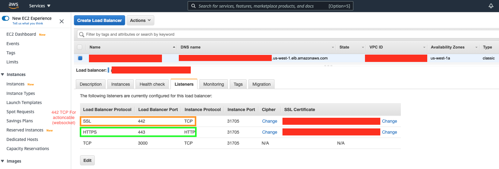

1. setup k8s cluster with kops
> https://www.changwoo.org/x1wins@changwoo.net/2021-02-20/setup-k8s-cluster-with-kops-52fc8a54c4
2. Set Database node
```
kubectl label nodes [YOUR_NODE_NAME] nodetype=database
```
3. Update s3, cloudfront env
[env-s3-prod-configmap.yaml](/k8s-manifests/env-s3-prod-configmap.yaml)
4. Update database env (if you want)
[env-prod-configmap.yaml](/k8s-manifests/env-prod-configmap.yaml)
    1. Regenerate RAILS_MASTER_KEY
        ```
            rm config/credentials.yml.enc 
            rm config/master.key 
            docker-compose run --no-deps web bin/rails credentials:show
            #NOT WORKING. You should use docker exec for interactive bash shell.
            #docker-compose run --no-deps web EDITOR=vim bin/rails credentials:edit 
            docker exec -it cw-ovp_web_1 /bin/bash
            root@bcde532ff8fd:/myapp# EDITOR=vim bin/rails credentials:edit
            
            Adding config/master.key to store the encryption key: 
            Xxxxxxxxxxxxxxxx

            Save this in a password manager your team can access.
            
            If you lose the key, no one, including you, can access anything encrypted with it.
            
                  create  config/master.key
            
            File encrypted and saved.
        ```
    2. RAILS_ACTION_CABLE_URL
        this project used Action cable(websocket). Action cable was working on TCP protocol with AWS ELB(elastic load balancer) in development enviroment.<br/>
        but we need HTTPS for secure to MITM in production. <br/>
        websocket use http when handshake and use TCP after end of handshake https://datatracker.ietf.org/doc/html/rfc6455#section-1.7 <br/> 
        if you open 443 port for SSL(TCP) and use 443 port for Action cable. you will see ```csrf token authenticity``` on web <br/>
        if you open 443 port for HTTPS(HTTP) and use 443 port for Action cable. you will see that action cable connection is not response.<br/>  
        AWS ELB(elastic load balancer) is not support websocket with HTTP, HTTPS protocal.<br/>
        - Solution
            
            1. open 443 port HTTPS protocal for only Web.
            2. open 442 port SSL protocal for only Action cable.
            3. Change Action cable default port 443 to 442 or another number.
                ```
                    RAILS_ACTION_CABLE_URL: "wss://[YOUR_DOMAIN]:442/cable"
                ```
5. Create deploy, pod, pvc 
```
kubectl create -f ./k8s-manifests
```
6. Delete
```
kubectl delete -f ./k8s-manifests
kubectl delete pvc --all
```
7. Get
```
kubectl get node
kubectl get pod
kubectl get deploy
kubectl get pvc
kubectl get configmap
kubectl get services 
```
> https://kubernetes.io/docs/reference/kubectl/cheatsheet/#viewing-finding-resources
8. How to Update Image
    1. build image
        ```
            docker image prune -a -f
            export IMAGE_URL=x1wins/cw-ovp:latest
            # export IMAGE_URL=[YOUR_PRIVATE_REGISTRY_URL]/cw-ovp:latest
            docker build -t cw-ovp .
            docker tag cw-ovp:latest ${IMAGE_URL}
            docker push ${IMAGE_URL}
        ```
    3. Update 
        there is a few method for update image. you can choose following for update image.
        1. set image and rollout
            ```
                export IMAGE_URL=x1wins/cw-ovp
                # export IMAGE_URL=[YOUR_PRIVATE_REGISTRY_URL]/cw-ovp:latest
           
                # Update sidekiq
                kubectl set image deployment/sidekiq-deployment sidekiq=${IMAGE_URL}  --record
                kubectl rollout status deployment/sidekiq-deployment
                # Update web
                kubectl set image deployment/web-deployment web=${IMAGE_URL}  --record
                kubectl rollout status deployment/web-deployment
                
                # or
                kubectl rollout restart deployment/sidekiq-deployment
                kubectl rollout restart deployment/web-deployment
            ```
        2. Force update
            web-deployment.yaml sidekiq-deployment.yaml has ```imagePullPolicy: "Always"``` this option will be auto update when changed image version to new one.
            but sometime auto update not working. we can force update with following command. 
            > https://stackoverflow.com/a/40368520/1399891
            ```
                kubectl delete -f ./k8s-manifests/web-deploy.yaml
                kubectl create -f ./k8s-manifests/web-deploy.yaml
                
                kubectl delete -f ./k8s-manifests/sidekiq-deploy.yaml
                kubectl create -f ./k8s-manifests/sidekiq-deploy.yaml
            ```
    4. Double check digest in remote k8s and local docker image
        ```
            % kubectl get pod web-deployment-c9499f695-nx6sd -o json | grep image
                "imageID": "docker-pullable://cw-ovp@sha256:cb0f03db72341c46521d2b18e5463c3c6039229761d7f01bfde457e6c8ed2e2d",
            
            % docker images --digests
            REPOSITORY                                            TAG                 DIGEST                                                                    IMAGE ID       CREATED         SIZE
            x1wins/cw-ovp                                         latest              sha256:cb0f03db72341c46521d2b18e5463c3c6039229761d7f01bfde457e6c8ed2e2d   509addaaa0ec   47 hours ago    5.34GB
        ```
8. rake db:create, db:migrate
```
# development
kubectl exec web -- bash -c 'cd /myapp && RAILS_ENV=development bin/rake db:create'
kubectl exec web -- bash -c 'cd /myapp && RAILS_ENV=development bundle exec rake db:migrate'
# production
kubectl exec web -- bash -c 'cd /myapp && RAILS_ENV=production bin/rake db:create'
kubectl exec web -- bash -c 'cd /myapp && RAILS_ENV=production bundle exec rake db:migrate'
kubectl exec web -- bash -c 'cd /myapp && RAILS_ENV=production bundle exec rake assets:precompile'
```
9. Script
    1. Bash
    ```
        kubectl exec --stdin --tty web-deployment-5b4cddf4dc-kc2vb -- /bin/bash
    ```
    2. Log
    ```
        kubectl exec --stdin --tty web-deployment-5b4cddf4dc-7hxm4 -- tail -f log/production.log
    ```
    3. Build
    ```
        cd CW-OVP/
        export IMAGE_URL=[YOUR_PRIVATE_REGISTRY_URL]/cw-ovp:latest
        export RAILS_MASTER_KEY=[RAILS_MASTER_KEY]
        export GIT_BRANCH=master
   
        git checkout ${GIT_BRANCH} && git pull origin ${GIT_BRANCH} && git reset --hard origin/${GIT_BRANCH} \
        && git branch -a && git rev-parse HEAD && git --no-pager log -n 60 --all --decorate --oneline --graph \
        && yes | docker system prune \
        && docker build --build-arg RAILS_MASTER_KEY=${RAILS_MASTER_KEY} -t cw-ovp . \
        && docker tag cw-ovp:latest ${IMAGE_URL} \
        && docker push ${IMAGE_URL}
    ```
    4. Deploy
    ```
        kubectl delete -f ./k8s-manifests/env-prod-configmap.yaml
        kubectl create -f ./k8s-manifests/env-prod-configmap.yaml
        kubectl describe configmap env-prod
        kubectl delete -f ./k8s-manifests/web-deploy.yaml
        kubectl create -f ./k8s-manifests/web-deploy.yaml
    ```
9. Dashboard
> https://kubernetes.io/docs/tasks/access-application-cluster/web-ui-dashboard/
```
kubectl apply -f https://raw.githubusercontent.com/kubernetes/dashboard/v2.2.0/aio/deploy/recommended.yaml
kubectl proxy
```
Open web browser 
> http://localhost:8001/api/v1/namespaces/kubernetes-dashboard/services/https:kubernetes-dashboard:/proxy/