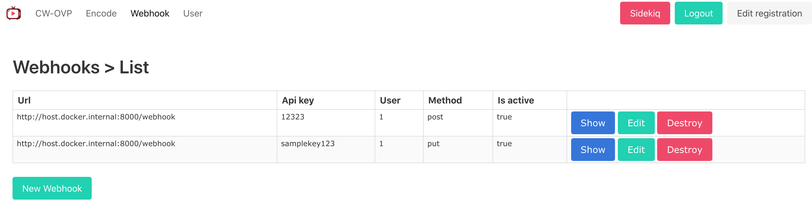

## Webhook
When transcoding or extract thumbnail image complete, you can get callback with webhook that saved Url, Api_key, Method, is_active.

this following Exaple Webhook Server will get complete callback with parameters values.

### Example Webhook Server
* download post-server.py https://gist.github.com/kylemcdonald/3bb71e4b901c54073cbc
[/webhook/post-server.py](/webhook/post-server.py)
```python
import SimpleHTTPServer
import SocketServer

PORT = 8000

class ServerHandler(SimpleHTTPServer.SimpleHTTPRequestHandler):

    def do_POST(self):
      content_len = int(self.headers.getheader('content-length', 0))
      post_body = self.rfile.read(content_len)
      print post_body

Handler = ServerHandler

httpd = SocketServer.TCPServer(("", PORT), Handler)

print "serving at port", PORT
httpd.serve_forever()
```

* Run sample post method server for webhook
```
% python ./webhook/post-server.py 
serving at port 8000
```

* Server got http request with Example Webhook Client that following curl or ruby client.
```
% python post-server.py
serving at port 8000
a=b
```
  
### Example Webhook Client  
* curl
```
% curl -i -X POST http://localhost:8000/webhook -d a=b
curl: (52) Empty reply from server

# in docker container
% curl -i -X POST http://host.docker.internal:8000/webhook -d a=b
```

* ruby client with Reflection
[/app/services/client/submit.rb](/app/services/client/submit.rb)
```ruby
require 'net/http'

begin
    callback_id = 1
    url = "http://localhost:8000/webhook"
    headers = {}
    uri = URI.parse(url)
    k = Net::HTTP.new(uri.host, uri.port)
    method = "post" # you can changing "post" method to another method that "put" or "delete" or your want method
    if k.respond_to?(method)
        response = k.public_send(method, uri.path, "callback_id=#{callback_id}", headers) 
    end
rescue => e
    puts e
ensure
    puts response
end
```